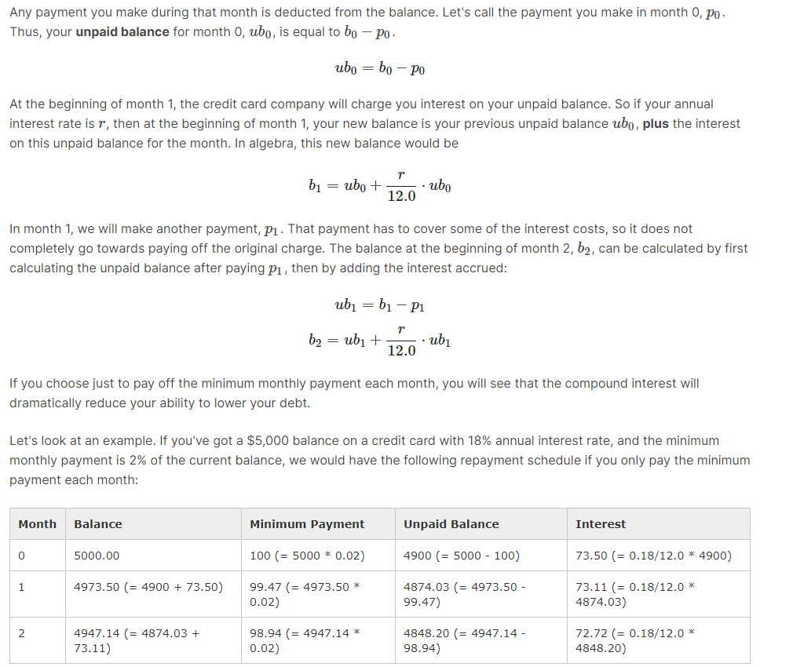

### Each month, a credit card statement will come with the option for you to pay a minimum amount of your charge, usually 2% of the balance due. However, the credit card company earns money by charging interest on the balance that you don't pay. So even if you pay credit card payments on time, interest is still accruing on the outstanding balance.
### Say you've made a $5,000 purchase on a credit card with an 18% annual interest rate and a 2% minimum monthly payment rate. If you only pay the minimum monthly amount for a year, how much is the remaining balance?

### You can think about this in the following way.

### At the beginning of month 0 (when the credit card statement arrives), assume you owe an amount we will call  b0  (b for balance; subscript 0 to indicate this is the balance at month 0).

### You can see that a lot of your payment is going to cover interest, and if you work this through month 12, you will see that after a year, you will have paid $1165.63 and yet you will still owe $4691.11 on what was originally a $5000.00 debt. Pretty depressing!